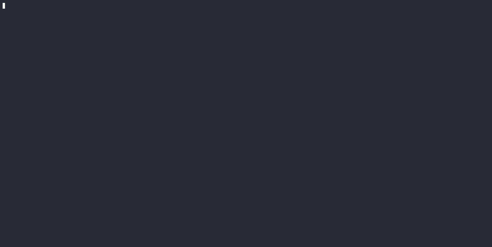

# Aplikasi golang search data di Rick and Morty API

## Berikut merupakan demo aplikasi berbasis golang, untuk searching data karakter Rick & Morty API

### Demo aplikasi

Data ini diambil dengan fitur method http Get, lalu di Unmarshall untuk membuatnya menjadi slice of struct, supaya bisa kita proses datanya di main
aplikasi ini juga menggunakan fitur Goroutine saat Fetch Data, sehingga ketika data masih kosong, kita bisa tampilkan pesan Loading.